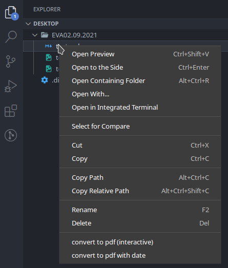
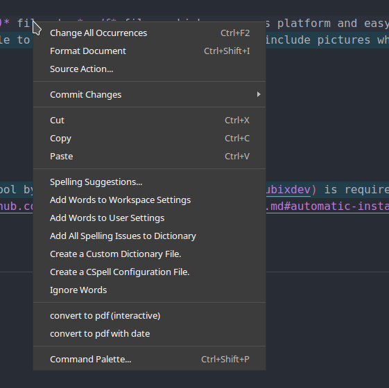
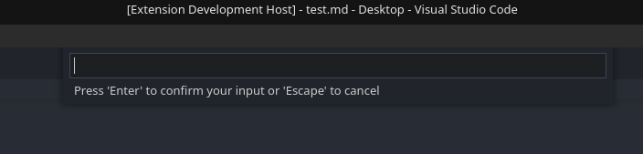
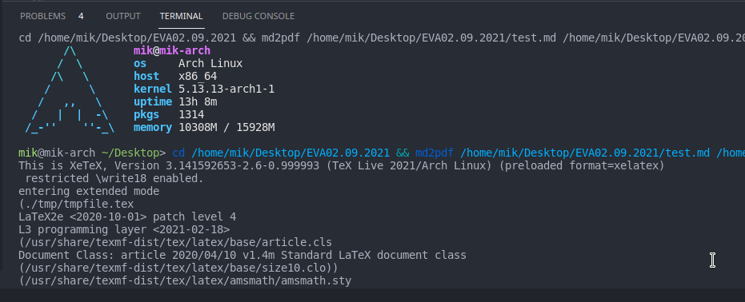

# School Notes README
# SchoolNotes
> The most basic but most practical way of keeping notes in school.

```
 ___     _             _ _  _     _          
/ __| __| |_  ___  ___| | \| |___| |_ ___ ___
\__ \/ _| ' \/ _ \/ _ \ | .` / _ \  _/ -_|_-<
|___/\__|_||_\___/\___/_|_|\_\___/\__\___/__/

                             ~.                   
                             ;,                   
                            ,gq`                  
                            :QQ`                  
                    `.,:;=/vu46KHDRgN#QQQ`yRx,    
    `'"!`!:,.`     ^KDR%HRHHDHHHdHRNN#QQQ`4NNNaz\,
jE8Q@@@@"@@@@QBgHj :/?==^!!:::,,,'..```    ,*F4j}U
```

## Installation
### File download
The extension file can be dowloaded [here.](https://github.com/MikMuellerDev/SchoolNotes-vs/releases/download/v1.0.0-beta.1/schoolnotes-vs-1.0.0-beta.1.vsix)

### Manual installation
1. Download the file using the link above.
2. Open *VsCode*
3. Open the extension submenu
4. Click on see more (*...*) in the rop right corner of the extension submenu.
5. Select *Install from VSIX*
6. Choose the downloaded release of *SchoolNotes-vs* in your location (must be the *.VSIX* file)
7. Enjoy and read the [usage](#usage)


### Automatic installation (recommended)
run following script (*not as root*)  
``` 
wget -O- 'https://raw.githubusercontent.com/MikMuellerDev/SchoolNotes-vs/main/install.sh' | bash
```

## Features

This extension is capable of converting *markdown (.md)* files to *.pdf* files, which are cross platform and easy to share.
Due to *Rubixdev's* *md2pdf* tool, the extension is able to convert beautiful tables and even include pictures which should be placed in the same folder as the *.md* file to be converted. 

## Usage

The converter can be started via a *right-click* on either the markdown file in the folder view or clicking anywhere on the opened markdown file.  





*Interactive mode* will ask for a custom text, which will be automatically placed on the *right-top* pf the pdf document.  
*With date* will not ask for this text, but instead uses the *local date* as a header in the *right-top* of the pdf document.  
When launching in interactive mode, type in the text you want at the top of the screen.

.


When converting, there will be a lot of output in the console, if there are markdown syntax errors in the document, there will be a prompt which you can skip with *Enter*

## Requirements

- A linux Computer (*Windows will not work*)
- The [*md2pdf*](https://github.com/RubixDev/md2pdf) tool by [*Rubixdev*](https://github.com/rubixdev) is required.
  - The installation is described [*here*](https://github.com/RubixDev/md2pdf/blob/main/README.md#automatic-installation)


## Extension Settings

This extension should work out of the box, thus requiring no extra settings.

## Known Issues

The *md2pdf* tool creates a *tmp* folder, if is should already be present in the same folder as the document to be converted, *md2pdf* will throw an error in order to protect your *tmp* folder. Make sure to (*re*)move this folder before proceeding.
If this folder somehow reappears, it is due to md2pdf closing unexpectedly (*eg. Closing Visual Studio*). If this was the case, proceed to just remove the folder again and it should work fine.

*If any bugs are encountered, open a issue on Github* [here](https://github.com/MikMuellerDev/SchoolNotes-vs)

## Release Notes

This is the first version of the *School Notes extension*
